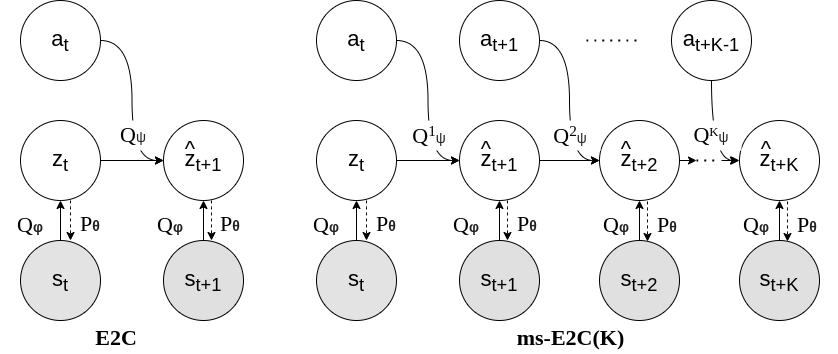

## Multi-step Embed To Control

Code for ms-E2C algorithm.

The core code is derived and inspired by [E2C-Pytorch](https://github.com/tung-nd/E2C-pytorch) E2C implementation. We open sourced only planar environment yet, stay tuned for updates. The code is still WIP, used for research purposes.
